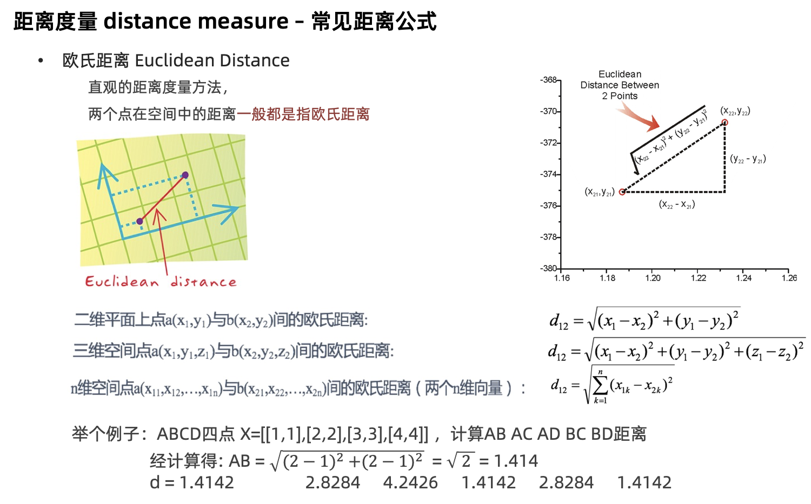
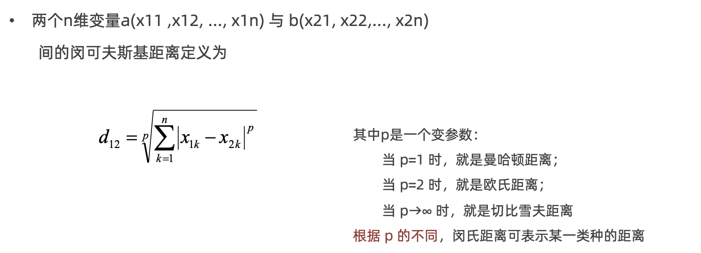
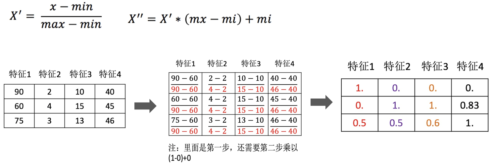

# KNN算法

## KNN算法简介

**学习目标：**

1.理解K近邻算法的思想

2.知道K值选择对结果影响

3.知道K近邻算法分类流程

4.知道K近邻算法回归流程

### 【理解】KNN算法思想

K-近邻算法（K Nearest Neighbor，简称KNN）。比如：根据你的“邻居”来推断出你的类别


KNN算法思想：如果一个样本在特征空间中的 k 个最相似的样本中的大多数属于某一个类别，则该样本也属于这个类别 

思考：如何确定样本的相似性？

**样本相似性**：样本都是属于一个任务数据集的。样本距离越近则越相似。

利用K近邻算法预测电影类型


### 【知道】K值的选择


### 【知道】KNN的应用方式

- 解决问题：分类问题、回归问题

- 算法思想：若一个样本在特征空间中的 k 个最相似的样本大多数属于某一个类别，则该样本也属于这个类别

- 相似性：欧氏距离

- 分类问题的处理流程：


1.计算未知样本到每一个训练样本的距离

2.将训练样本根据距离大小升序排列

3.取出距离最近的 K 个训练样本

4.进行多数表决，统计 K 个样本中哪个类别的样本个数最多

5.将未知的样本归属到出现次数最多的类别


- 回归问题的处理流程：


1.计算未知样本到每一个训练样本的距离

2.将训练样本根据距离大小升序排列

3.取出距离最近的 K 个训练样本

4.把这个 K 个样本的目标值计算其平均值

5.作为将未知的样本预测的值


## API介绍

**学习目标：**

1.掌握KNN算法分类API

2.掌握KNN算法回归API

### 【实操】分类API

KNN分类API：

```python
sklearn.neighbors.KNeighborsClassifier(n_neighbors=5) 
```

​     n_neighbors：int,可选（默认= 5），k_neighbors查询默认使用的邻居数


### 【实操】回归API

KNN分类API：

```python
sklearn.neighbors.KNeighborsRegressor(n_neighbors=5)
```

```python
# 1.工具包
from sklearn.neighbors import KNeighborsClassifier,KNeighborsRegressor
# from sklearn.neighbors import KNeighborsRegressor

# 2.数据(特征工程)
# 分类
# x = [[0,2,3],[1,3,4],[3,5,6],[4,7,8],[2,3,4]]
# y = [0,0,1,1,0]
x = [[0,1,2],[1,2,3],[2,3,4],[3,4,5]]
y = [0.1,0.2,0.3,0.4]

# 3.实例化
# model =KNeighborsClassifier(n_neighbors=3)
model =KNeighborsRegressor(n_neighbors=3)

# 4.训练
model.fit(x,y)

# 5.预测
print(model.predict([[4,4,5]]))
```


## 距离度量方法

**学习目标：**

1.掌握欧氏距离的计算方法 

2.掌握曼哈顿距离的计算方法

3.了解切比雪夫距离的计算方法

4.了解闵可夫斯基距离的计算方法

### 【掌握】欧式距离




### 【掌握】曼哈顿距离


### 【了解】切比雪夫距离


### 【了解】闵氏距离

•闵可夫斯基距离 Minkowski Distance 闵氏距离，不是一种新的距离的度量方式。而是距离的组合 是对多个距离度量公式的概括性的表述




## 特征预处理

**学习目标：**

1.知道为什么进行归一化、标准化

2.能应用归一化API处理数据

3.能应用标准化API处理数据

4.使用KNN算法进行鸢尾花分类

### 【知道】为什么进行归一化、标准化

特征的**单位或者大小相差较大，或者某特征的方差相比其他的特征要大出几个数量级**，**容易影响（支配）目标结果**，使得一些模型（算法）无法学习到其它的特征。


### 【掌握】归一化

通过对原始数据进行变换把数据映射到【mi,mx】(默认为[0,1])之间



数据归一化的API实现

```
sklearn.preprocessing.MinMaxScaler (feature_range=(0,1)… )
```

 feature_range 缩放区间

- 调用 fit_transform(X) 将特征进行归一化缩放


归一化受到最大值与最小值的影响，这种方法容易受到异常数据的影响, 鲁棒性较差，适合传统精确小数据场景

### 【掌握】标准化

通过对原始数据进行标准化，转换为均值为0标准差为1的标准正态分布的数据


* mean 为特征的平均值
* σ 为特征的标准差

数据标准化的API实现

```python
sklearn.preprocessing. StandardScaler()
```

调用 fit_transform(X) 将特征进行归一化缩放


```python
# 1.导入工具包
from sklearn.preprocessing import MinMaxScaler,StandardScaler

# 2.数据(只有特征)
x = [[90, 2, 10, 40], [60, 4, 15, 45], [75, 3, 13, 46]]

# 3.实例化(归一化,标准化)
# process =MinMaxScaler()
process =StandardScaler()

# 4.fit_transform 处理1
data =process.fit_transform(x)
# print(data)

print(process.mean_)
print(process.var_)
```


对于标准化来说，如果出现异常点，由于具有一定数据量，少量的异常点对于平均值的影响并不大

### 【实操】利用KNN算法进行鸢尾花分类

鸢尾花Iris Dataset数据集是机器学习领域经典数据集，鸢尾花数据集包含了150条鸢尾花信息，每50条取自三个鸢尾花中之一：Versicolour、Setosa和Virginica


每个花的特征用如下属性描述：


代码实现：


```python
# 0.导入工具包
from sklearn.datasets import load_iris
import seaborn as sns
import matplotlib.pyplot as plt
import pandas as pd
from sklearn.model_selection import train_test_split
from sklearn.preprocessing import StandardScaler
from sklearn.neighbors import KNeighborsClassifier
from sklearn.metrics import accuracy_score

# 1.加载数据集
iris_data = load_iris()
# print(iris_data)
# print(iris_data.target)


# 2.数据展示
iris_df = pd.DataFrame(iris_data['data'], columns=iris_data.feature_names)
iris_df['label'] = iris_data.target
# print(iris_data.feature_names)
# sns.lmplot(x='sepal length (cm)',y='sepal width (cm)',data = iris_df,hue='label')
# plt.show()


# 3.特征工程(预处理-标准化)
# 3.1 数据集划分
x_train, x_test, y_train, y_test = train_test_split(iris_data.data, iris_data.target, test_size=0.3, random_state=22)
print(len(iris_data.data))
print(len(x_train))
# 3.2 标准化
process = StandardScaler()
x_train = process.fit_transform(x_train)
x_test = process.transform(x_test)
# 4.模型训练
# 4.1 实例化
model = KNeighborsClassifier(n_neighbors=3)
# 4.2 调用fit法
model.fit(x_train,y_train)
# 5.模型预测
x = [[5.1, 3.5, 1.4, 0.2]]
x=process.transform(x)
y_predict =model.predict(x_test)
print(model.predict_proba(x))

# 6.模型评估(准确率)
# 6.1 使用预测结果
acc =accuracy_score(y_test,y_predict)
print(acc)

# 6.2 直接计算
acc = model.score(x_test,y_test)
print(acc)

```


## 超参数选择的方法

**学习目标：**

1.知道交叉验证是什么？

2.知道网格搜索是什么？

3.知道交叉验证网格搜索API函数用法

4.能实践交叉验证网格搜索进行模型超参数调优

5.利用KNN算法实现手写数字识别

### 【知道】交叉验证

交叉验证是一种数据集的分割方法，将训练集划分为 n 份，其中一份做验证集、其他n-1份做训练集集 


**交叉验证法原理**：将数据集划分为 cv=10 份：

1.第一次：把第一份数据做验证集，其他数据做训练

2.第二次：把第二份数据做验证集，其他数据做训练

3.... 以此类推，总共训练10次，评估10次。

4.使用训练集+验证集多次评估模型，取平均值做交叉验证为模型得分

5.若k=5模型得分最好，再使用全部训练集(训练集+验证集) 对k=5模型再训练一边，再使用测试集对k=5模型做评估


### 【知道】网格搜索


交叉验证网格搜索的API:


交叉验证网格搜索在鸢尾花分类中的应用：

```python
# 0.导入工具包
from sklearn.datasets import load_iris
from sklearn.model_selection import train_test_split,GridSearchCV
from sklearn.preprocessing import StandardScaler
from sklearn.neighbors import KNeighborsClassifier
from sklearn.metrics import accuracy_score

# 1.加载数据
data = load_iris()

# 2 数据集划分
x_train,x_test,y_train,y_test=train_test_split(data.data,data.target,test_size=0.2,random_state=22)

# 3.特征预处理
pre = StandardScaler()
x_train=pre.fit_transform(x_train)
x_test=pre.transform(x_test)

# 4.模型实例化+交叉验证+网格搜索
model = KNeighborsClassifier(n_neighbors=1)
paras_grid = {'n_neighbors':[4,5,7,9]}
# estimator =GridSearchCV(estimator=model,param_grid=paras_grid,cv=4)
# estimator.fit(x_train,y_train)

# print(estimator.best_score_)
# print(estimator.best_estimator_)
# print(estimator.cv_results_)

model = KNeighborsClassifier(n_neighbors=7)
model.fit(x_train,y_train)
x = [[5.1, 3.5, 1.4, 0.2]]
x=pre.transform(x)
y_prdict=model.predict(x_test)

print(accuracy_score(y_test,y_prdict))


```


### 利用KNN算法实现手写数字识别


MNIST手写数字识别 是计算机视觉领域中 "hello world"级别的数据集

- 1999年发布，成为分类算法基准测试的基础
- 随着新的机器学习技术的出现，MNIST仍然是研究人员和学习者的可靠资源。

本次案例中，我们的目标是从数万个手写图像的数据集中正确识别数字。

### 数据介绍

数据文件 train.csv 和 test.csv 包含从 0 到 9 的手绘数字的灰度图像。

- 每个图像高 28 像素，宽28 像素，共784个像素。

- 每个像素取值范围[0,255]，取值越大意味着该像素颜色越深

- 训练数据集（train.csv）共785列。第一列为 "标签"，为该图片对应的手写数字。其余784列为该图像的像素值

- 训练集中的特征名称均有pixel前缀，后面的数字（[0,783])代表了像素的序号。

像素组成图像如下：

```python
000 001 002 003 ... 026 027
028 029 030 031 ... 054 055
056 057 058 059 ... 082 083
 | | | | ...... | |
728 729 730 731 ... 754 755
756 757 758 759 ... 782 783
```

数据集示例如下:


```

```


## 作业

1.完成KNN算法部分的思维导图


2.说明常见的距离度量方法


3.说明特征预处理的方法


4.编写KNN代码实现鸢尾花分类案例


5.编写KNN代码实现手写数字识别（特征预处理，交叉验证网格搜索）